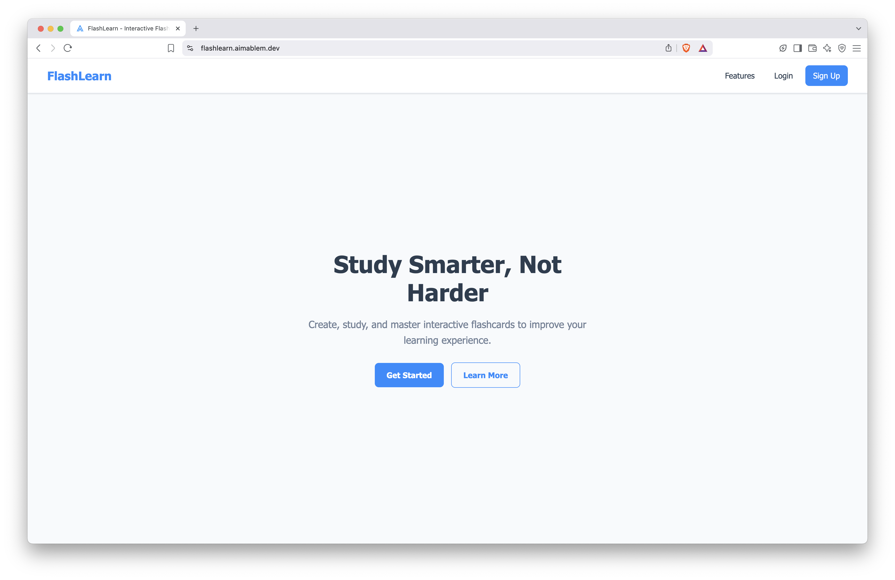
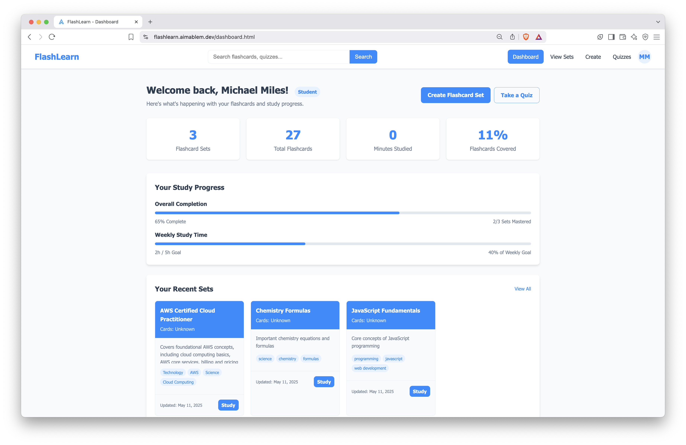

<p align="center">
  
</p>

# FlashLearn - Cloud-Powered Learning Platform





A DevOps showcase project demonstrating modern cloud infrastructure deployment and containerization practices. This interactive flashcard learning application is fully orchestrated with Docker Compose, deployed on AWS, and automated with a complete CI/CD pipeline.

**Live Infrastructure**: Frontend at [flashlearn.aimablem.dev](https://flashlearn.aimablem.dev) and API at [api.aimablem.dev](https://api.aimablem.dev)

> **DevOps Focus**: This project demonstrates end-to-end cloud infrastructure management, containerization, and automation rather than just application development.

> **Cloud & DevOps Tools**: AWS EC2, Route 53, Docker, Docker Compose, Docker Hub, GitHub Actions CI/CD, NGINX reverse proxy, Let's Encrypt, Certbot

## Cloud & DevOps Highlights

- **Containerized Microservices**: Multi-container architecture with separate frontend and backend services
- **Infrastructure as Code**: Fully orchestrated with Docker Compose for consistent deployments
- **CI/CD Automation**: Complete GitHub Actions pipeline for building, testing, and deploying containers
- **AWS Cloud Architecture**: Production-grade EC2 deployment with proper security groups and networking
- **Domain Management**: Custom domain with Route 53 and subdomain configuration for microservices
- **Security Implementation**: HTTPS enforcement with Let's Encrypt certificates and NGINX configuration
- **High Availability**: Container health checks, restart policies, and systematic deployment strategy


## Table of Contents

- [DevOps Infrastructure](#devops-infrastructure)
- [Cloud Architecture](#cloud-architecture)
- [CI/CD Pipeline](#cicd-pipeline)
- [Containerization Strategy](#containerization-strategy)
- [Infrastructure Security](#infrastructure-security)
- [Monitoring & Reliability](#monitoring--reliability)
- [Application Overview](#application-overview)
- [Deployment Workflow](#deployment-workflow)
- [Challenges & Solutions](#challenges--solutions)
- [Future DevOps Improvements](#future-devops-improvements)
- [Getting Started](#getting-started)
- [Contact](#contact)

## Application Overview

While the primary focus of this project is showcasing cloud and DevOps skills, here's a brief overview of the application itself:

### Features

- **User Management**: Secure authentication system with JWT tokens
- **Flashcard Creation**: Users can create and manage study materials
- **Study Experience**: Interactive flashcard review system
- **Content Discovery**: Public sets browsing and filtering
- **Progress Tracking**: Statistics to measure learning progress

> **Component Documentation:**
> - [Frontend Implementation Details](./frontend/README.md)
> - [Backend API Documentation](./backend/README.md)

### Backend API Architecture
## DevOps Infrastructure

FlashLearn demonstrates a comprehensive DevOps approach:

- **Cloud-Native Architecture**: Built specifically for AWS deployment with scalability in mind
- **Microservices Design**: Separated frontend and backend containers with independent scaling and deployment
- **Infrastructure Automation**: Deployment process fully automated from code commit to production
- **Configuration Management**: Environment variables and secrets managed securely in pipeline
- **Continuous Deployment**: Each commit to main branch automatically builds, tests, and deploys to production
- **Reverse Proxy Configuration**: NGINX handles SSL termination, request routing, and load balancing

This project showcases the complete DevOps lifecycle across development, testing, deployment, and monitoring phases.

## Cloud Architecture

The FlashLearn infrastructure leverages AWS services to provide a secure, scalable environment:

```
                          ┌─────────────────┐
                          │  GitHub Actions │
                          │    CI/CD        │
                          └────────┬────────┘
                                   │
                                   ▼
┌─────────────┐           ┌────────────────┐
│   GitHub    │──Push────▶│  Docker Hub    │
│ Repository  │           │ Container Reg. │
└─────────────┘           └────────┬───────┘
                                   │
                                   ▼
┌─────────────┐           ┌────────────────┐         ┌─────────────┐
│   Internet  │───DNS────▶│   Route 53     │────┐    │ Let's       │
│             │           │                │    │    │ Encrypt     │
└──────┬──────┘           └────────────────┘    │    │ Certificates│
       │                                         │    └──────┬──────┘
       │                                         │           │
       ▼                                         ▼           │
┌──────────────────────── AWS EC2 ───────────────────────────┐
│                                                             │
│  ┌─────────────────┐    ┌─────────────────┐                │
│  │     NGINX       │    │   Docker        │                │
│  │  Reverse Proxy  │───▶│ Compose Network │                │
│  └─────────────────┘    │                 │                │
│                         │  ┌─────────┐    │                │
│                         │  │Frontend │    │                │
│                         │  │Container│    │                │
│                         │  └────┬────┘    │                │
│                         │       │         │                │
│                         │  ┌────▼─────┐   │                │
│                         │  │ Backend  │   │                │
│                         │  │Container │   │                │
│                         │  └────┬─────┘   │                │
│                         │       │         │                │
│                         │       ▼         │                │
│                         │  ┌──────────┐   │                │
│                         │  │MongoDB   │   │                │
│                         │  │Container │   │                │
│                         │  └──────────┘   │                │
│                         └─────────────────┘                │
│                                                             │
└─────────────────────────────────────────────────────────────┘
```

### AWS Services Configuration

- **EC2 Instance**: t2.micro running Ubuntu 22.04
- **Security Groups**: Precisely configured for HTTP(80), HTTPS(443), and SSH(22) only
- **Route 53**: Domain name management with A records and CNAME for www subdomain
- **Subdomains**: Frontend (flashlearn.aimablem.dev) and API (api.aimablem.dev) separation

### System Architecture

- **Multi-Container Design**: Separate containers for frontend, backend, and database
- **NGINX Reverse Proxy**: Handles routing, SSL termination, and security headers
- **Docker Network**: Private internal network for container communication
- **Volume Persistence**: Database data persisted across container restarts and deployments

## CI/CD Pipeline

The project showcases a fully automated CI/CD pipeline using GitHub Actions that triggers on every commit to the main branch:

```yaml
name: Deploy FlashLearn to AWS EC2 Instance

on:
  push:
    branches:
      - main

jobs:
  deploy:
    runs-on: ubuntu-latest

    steps:
      - name: Checkout Code
        uses: actions/checkout@v4

      - name: Log in to Docker Hub
        uses: docker/login-action@v3
        with:
          username: ${{ secrets.DOCKER_USERNAME }}
          password: ${{ secrets.DOCKER_PASSWORD }}

      - name: Build frontend Docker image
        run: docker build -t ${{ secrets.DOCKER_USERNAME }}/flashlearn:frontend-latest ./frontend

      - name: Build backend Docker image
        run: docker build -t ${{ secrets.DOCKER_USERNAME }}/flashlearn:backend-latest ./backend

      - name: Push frontend to Docker Hub
        run: docker push ${{ secrets.DOCKER_USERNAME }}/flashlearn:frontend-latest

      - name: Push backend to Docker Hub
        run: docker push ${{ secrets.DOCKER_USERNAME }}/flashlearn:backend-latest

      - name: SSH into EC2 and Deploy New Container
        uses: appleboy/ssh-action@v0.1.7
        with:
          host: ${{secrets.EC2_PUBLIC_IP}}
          username: ubuntu
          key: ${{secrets.EC2_SSH_PRIVATE_KEY}}
          script: |
            cd flashlearn
            docker-compose down || true
            docker-compose pull 
            docker-compose up -d

      - name: Test Frontend Is Live
        run: |
          curl --fail --silent --show-error https://flashlearn.aimablem.dev || exit 1

      - name: Test Backend Is Live
        run: |
          for i in {1..10}; do
            echo "Checking backend (try $i)..."
            if curl --fail --silent --show-error https://api.aimablem.dev; then
              echo "Backend is up!"
              exit 0
            fi
            sleep 5
          done
          echo "Backend failed to respond after 10 attempts."
          exit 1
```

### Pipeline Features

- **Automated Triggers**: Every push to main branch initiates deployment
- **Container Registry Integration**: Images built and pushed to Docker Hub
- **SSH Deployment**: Secure remote execution of deployment commands
- **Zero-Downtime Deployment**: Properly orchestrated container replacement
- **Post-Deployment Testing**: Health checks verify successful deployment
- **Secret Management**: Sensitive information stored as GitHub secrets
- **Failure Handling**: Proper error checking and reporting throughout pipeline

The pipeline demonstrates industry best practices for continuous deployment with proper security, testing, and infrastructure management

## Containerization Strategy

The application uses Docker containerization with a multi-container architecture orchestrated by Docker Compose:

### Docker Compose Configuration

```yaml
version: "3.9"

services:
  frontend:
    image: aimablm/flashlearn:frontend-latest
    container_name: flashlearn-frontend
    restart: always
    ports:
      - "3050:80"
    networks:
      - flashlearn_net

  backend:
    image: aimablm/flashlearn:backend-latest
    container_name: flashlearn-backend
    restart: always
    ports:
      - "5000:5000"
    environment:
      - NODE_ENV=production
      - PORT=5000
      - MONGODB_URI=
      - JWT_SECRET=
    networks:
      - flashlearn_net

networks:
  flashlearn_net:
    name: flashlearn-internal-net
    driver: bridge
```

### Frontend Container (Nginx Static Files)

```dockerfile
# Use official NGINX base image
FROM nginx:alpine

# Clean default HTML content
RUN rm -rf /usr/share/nginx/html/*

# Copy all static files from the current directory to NGINX's web root
COPY . /usr/share/nginx/html

# Expose port 80
EXPOSE 80

# Run NGINX in the foreground
CMD ["nginx", "-g", "daemon off;"]
```

### Backend Container (Node.js API)

```dockerfile
FROM node:16-alpine

# Create app directory
WORKDIR /usr/src/app

# Copy package.json and package-lock.json
COPY package*.json ./

# Install dependencies
RUN npm install

# Copy app source code
COPY . .

# Expose port
EXPOSE 5000

# Set environment variables
ENV NODE_ENV=production

# Command to run the application
CMD ["node", "server.js"]
```

### Containerization Benefits

- **Isolation**: Each component runs in its own isolated environment
- **Consistency**: Same environment in development and production
- **Scalability**: Easy horizontal scaling with container replication
- **Resource Efficiency**: Optimized resource utilization
- **Portability**: Consistent deployment across different environments
- **Versioning**: Precise versioning of application components
- **Simplified Deployment**: Streamlined deployment process

This approach showcases modern containerization practices that enhance both development and operational efficiency.

## Infrastructure Security

Security is implemented at multiple levels throughout the infrastructure:

### Network Security

- **Security Groups**: EC2 instance configured with strict inbound/outbound rules
- **Private Docker Network**: Container-to-container communication isolated from public network
- **HTTPS Enforcement**: All HTTP traffic automatically redirected to HTTPS
- **Subdomain Isolation**: Frontend and backend services on separate subdomains

### NGINX Security Configuration

```nginx
server {
    listen 80;
    server_name flashlearn.aimablem.dev api.aimablem.dev;
    return 301 https://$host$request_uri;
}

server {
    listen 443 ssl;
    server_name flashlearn.aimablem.dev;

    ssl_certificate /etc/letsencrypt/live/flashlearn.aimablem.dev/fullchain.pem;
    ssl_certificate_key /etc/letsencrypt/live/flashlearn.aimablem.dev/privkey.pem;
    include /etc/letsencrypt/options-ssl-nginx.conf;
    ssl_dhparam /etc/letsencrypt/ssl-dhparams.pem;

    # Security headers
    add_header X-Content-Type-Options nosniff;
    add_header X-Frame-Options DENY;
    add_header X-XSS-Protection "1; mode=block";
    add_header Strict-Transport-Security "max-age=31536000; includeSubDomains" always;

    location / {
        proxy_pass http://localhost:3050;
        proxy_http_version 1.1;
        proxy_set_header Upgrade $http_upgrade;
        proxy_set_header Connection 'upgrade';
        proxy_set_header Host $host;
        proxy_set_header X-Forwarded-Proto $scheme;
        proxy_cache_bypass $http_upgrade;
    }
}
```

### Certificate Management

- **Let's Encrypt**: Automated certificate generation and renewal
- **Certbot**: Manages certificate installation and NGINX configuration
- **Strong Cipher Configuration**: Modern encryption standards for SSL/TLS

### Container Security

- **Non-Root Users**: Containers configured to run as non-root when possible
- **Health Checks**: Automated verification of container health
- **Restart Policies**: Automatic recovery from container failures
- **Environment Separation**: Sensitive configuration via environment variables

This multi-layered security approach demonstrates industry best practices for securing cloud infrastructure and containerized applications.

## Monitoring & Reliability

The infrastructure includes several components to ensure high availability and performance:

### High Availability Features

- **Container Restart Policies**: `restart: always` ensures containers automatically recover
- **Health Checks**: Backend and frontend services verified by monitoring endpoints
- **Graceful Deployments**: Zero-downtime deployments with proper container shutdown/startup

### Monitoring Implementation

- **Container Logs**: Centralized logging for troubleshooting and monitoring
- **Health Checks Integration**: Pipeline verifies application health after deployment
- **Error Notification**: Deployment pipeline alerts on failures
- **Infrastructure Monitoring**: System-level monitoring for the EC2 instance

### Automation for Reliability

- **Automated Certificate Renewal**: Let's Encrypt certificates auto-renewed
- **Self-Healing Infrastructure**: Container health checks trigger automatic recovery
- **Consistent Deployments**: Docker-based deployments ensure consistency across environments

These reliability features ensure the application maintains high uptime and performance even during deployments or system failures.

## Application Overview

While the primary focus of this project is showcasing cloud and DevOps skills, here's a brief overview of the application itself:

### Features

- **User Management**: Secure authentication system with JWT tokens
- **Flashcard Creation**: Users can create and manage study materials
- **Study Experience**: Interactive flashcard review system
- **Content Discovery**: Public sets browsing and filtering
- **Progress Tracking**: Statistics to measure learning progress

### Backend API Architecture

The backend follows a RESTful design with these core endpoints:

- **Authentication**: `/auth/register`, `/auth/login`
- **User Management**: `/users/:id`, `/users/:id/stats`
- **Flashcard Sets**: `/sets/public`, `/sets/:id`, `/sets/:setId/flashcards`
- **Flashcards**: `/flashcards`, `/flashcards/:id`

### Database Design

MongoDB database with three main collections:

- **Users**: Authentication and profile information
- **FlashcardSet**: Sets with metadata and ownership
- **Flashcard**: Individual cards linked to sets

Optimized with strategic indexing for query performance:

```javascript
// Create index for faster querying by setId
flashcardSchema.index({ setId: 1 });

// Create index for faster querying by userId
flashcardSetSchema.index({ userId: 1 });

// Create index for faster querying public sets
flashcardSetSchema.index({ isPublic: 1 });
```

The application architecture complements the infrastructure design with clean separation of concerns and modular components.

## Deployment Workflow

The complete deployment workflow demonstrates the full DevOps lifecycle:

1. **Code Commit**: Developer pushes code to GitHub repository
2. **CI/CD Trigger**: GitHub Actions workflow automatically starts
3. **Build Phase**: Docker images built for frontend and backend services
4. **Registry Push**: Images pushed to Docker Hub with proper versioning
5. **Server Connection**: SSH into EC2 instance with secure key authentication
6. **Deployment**: Docker Compose pulls latest images and orchestrates containers
7. **Validation**: Health checks verify successful deployment of all services
8. **Monitoring**: Ongoing checks ensure system stability

This workflow demonstrates the efficient DevOps principle of continuous deployment with proper automation, testing, and infrastructure management.

## Challenges & Solutions

This project addressed several cloud engineering and DevOps challenges:

### Challenge 1: Multi-Container Architecture Design

**Challenge**: Designing a scalable, maintainable multi-container architecture that separates concerns while enabling efficient communication.

**Solution**: Implemented Docker Compose with a custom network that:
- Isolates services in separate containers
- Provides clear separation of concerns
- Enables internal networking between containers
- Simplifies configuration with environment variables

### Challenge 2: HTTPS Configuration with Multiple Subdomains

**Challenge**: Configuring NGINX to handle multiple subdomains with proper SSL certificates and security headers.

**Solution**: Created a sophisticated NGINX configuration that:
- Routes requests to appropriate containers based on subdomain
- Implements proper SSL termination with Let's Encrypt certificates
- Sets up security headers to prevent common web vulnerabilities
- Enforces HTTPS for all connections

### Challenge 3: Reliable CI/CD Pipeline

**Challenge**: Creating a robust deployment pipeline that ensures zero-downtime deployments and proper error handling.

**Solution**: Developed a GitHub Actions workflow that:
- Properly manages sensitive secrets
- Uses parallel builds for efficiency
- Includes comprehensive error handling
- Implements health checks to validate deployments
- Provides clear feedback on deployment status

These solutions demonstrate best practices in cloud architecture, security configuration, and deployment automation.

## Future DevOps Improvements

As a continuously evolving DevOps project, these are planned infrastructure improvements:

- **Container Orchestration**: Migrate to Kubernetes for advanced scaling and management
- **Infrastructure as Code**: Implement Terraform for AWS resource provisioning
- **Enhanced Monitoring**: Add Prometheus and Grafana for comprehensive metrics
- **Log Aggregation**: Implement ELK stack (Elasticsearch, Logstash, Kibana) for centralized logging
- **Automated Backups**: Implement automated database backup and recovery
- **Blue-Green Deployments**: Implement zero-downtime deployment strategy
- **Performance Testing**: Add load testing in the CI/CD pipeline
- **Cost Optimization**: Implement AWS cost management and optimization
- **Security Scanning**: Add container vulnerability scanning to the pipeline

These enhancements would further demonstrate advanced DevOps practices and cloud engineering principles.

## Getting Started

For developers interested in this project, here's how to set up the local environment:

### Prerequisites
- Docker and Docker Compose installed
- AWS CLI configured (for deployment)
- Node.js and npm (for local development)

### Local Development with Docker
```bash
# Clone the repository
git clone https://github.com/aimablM/flashlearn.git
cd flashlearn

# Create environment file
cp .env.example .env
# Edit .env with your configuration

# Start the development environment
docker-compose -f docker-compose.dev.yml up
```

### Deployment Process
```bash
# Configure AWS CLI
aws configure

# Deploy infrastructure (if using Terraform)
cd terraform
terraform init
terraform apply

# Manual deployment to EC2
ssh -i ~/.ssh/your-key.pem ubuntu@your-ec2-instance
cd ~/flashlearn
git pull
docker-compose pull
docker-compose up -d
```

## Contact

- **Name**: Aimable M.
- **Portfolio**: [aimablem.dev](https://aimablem.dev)
- **LinkedIn**: [linkedin.com/in/aimable-m-920608107](https://linkedin.com/in/aimablem)
- **GitHub**: [github.com/aimablM](https://github.com/aimablM)
- **Email**: aimable.mugwaneza@gmail.com

*Specializing in Cloud Engineering, DevOps, and Infrastructure Automation*